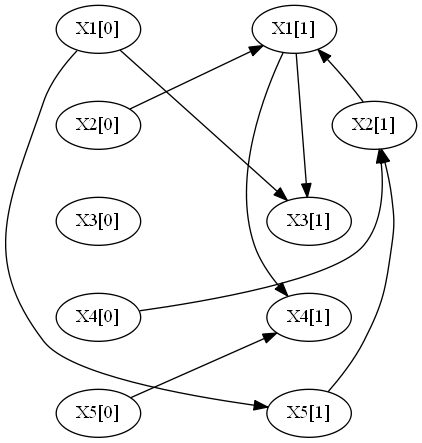
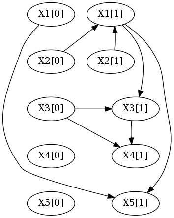

## Program description

learnDBN is a Java implementation of a Dynamic Bayesian Network (DBN) structure learning algorithm. It can learn tDBN, cDBN and bcDBN structures from a file with multivariate longitudinal observations. Also, it improves these algorithms by allowing the data to have missing values. As such this implementation can impute missing values.


## Current release

This is the first implementation of this program. It comes packaged as an executable JAR file, already including the required external libraries.


## Usage

By executing the jar file ...

```shell
$ java -jar learnDBN.jar 
```
... the available command-line options are shown:

```
usage: learnDBN
 -bcDBN,--bcDBN               Learns a bcDBN structure.
 -c,--compact                 Outputs network in compact format, omitting
                              intra-slice edges. Only works if specified
                              together with -d and with --markovLag 1.
 -cDBN,--cDBN                 Learns a cDBN structure.
 -d,--dotFormat               Outputs network in dot format, allowing
                              direct redirection into Graphviz to
                              visualize the graph.
 -i,--file <file>             Input CSV file to be used for network
                              learning.
 -imp,--impute                If the file has missing values impute these
                              values. The resulting data with imputed
                              values is saved in the same folder with
                              <filename>_imputed.csv
 -ind,--intra_in <int>        In-degree of the intra-slice network
 -m,--markovLag <int>         Maximum Markov lag to be considered, which
                              is the longest distance between connected
                              time-slices. Default is 1, allowing edges
                              from one preceding slice.
 -mt,--MultiThread            Learns the DBN using parallel computations.
 -ns,--nonStationary          Learns a non-stationary network (one
                              transition network per time transition). By
                              default, a stationary DBN is learnt.
 -o,--outputFile <file>       Writes output to <file>. If not supplied,
                              output is written to terminal.
 -p,--numParents <int>        Maximum number of parents from preceding
                              time-slice(s).
 -pm,--parameters             Learns and outputs the network parameters.
 -r,--root <int>              Root node of the intra-slice tree. By
                              default, root is arbitrary.
 -s,--scoringFunction <arg>   Scoring function to be used, either MDL or
                              LL. MDL is used by default.
 -sp,--spanning               Forces intra-slice connectivity to be a tree
                              instead of a forest, eventually producing a
                              structure with a lower score.
```


## Input file format

The input file should be in comma-separated values (CSV) format.

*   The first line is the header, naming the attributes and specifying the time slice index, separared by two underscores: "attributeName__t"
*   The order of the attributes must be maintained: "X1__1", "X2__1", "X1__2", "X2__2".
*   The first column contains an identification (string or number) of each subject (this identifier does not affect the learnt network).
*   All other lines correspond to observations of an individual over time.
*   Missing values can be marked as "?" but should not occur, as the algorithm discards the observation (time slice) in question.
*   The variables can have numerical and categorical values.

A very simplistic input file example is the following:

```
"subject_id","X1__0","X2__0","X3__0","X1__1","X2__1","X3__1","X1__2","X2__2","X3__2"
"6","7.0","40.0","5.0","7.0","20.0","5.0","4.0","20.0","5.0"
"7","4.0","40.0","5.0","7.0","40.0","5.0","7.0","40.0","5.0"
"8","7.0","20.0","5.0","7.0","40.0","5.0","4.0","20.0","9.0"
"9","7.0","40.0","9.0","7.0","20.0","5.0","7.0","40.0","?"
"10","7.0","20.0","5.0","4.0","20.0","9.0","7.0","20.0","9.0"
"11","?","20.0","5.0","?","20.0","5.0","4.0","20.0","9.0"
"12","4.0","20.0","5.0","7.0","20.0","5.0","4.0","20.0","9.0"
```
## Example

The first example considers a synthetic network structure with 5 attributes, each one taking 4 states and one parent from the preceding slice ([t] denotes the time slice):



The above network was sample to produce the following file:
*   [exmp1.csv](./exmp1.csv), with 1000 observations with 5 time steps, 20% of missing values, 20% of observations with missing values

As all nodes have exactly one parent from the past, the best options are to limit the number of parents with -p 1.

The command to learn the network and impute the missing values is:
```shell
java -jar learnDBN.jar -i exmp1.csv -p 1 -imp -mt
```

which produces the following output:
```
Evaluating network with MDL score.
Found missing values in data.
Parameter EM step: 1 score: -32184.7968939429
Parameter EM step: 2 score: -32116.81895576152
Parameter EM step: 3 score: -32115.385956588492
Parameter EM step: 4 score: -32115.342586060127
Parameter EM step: 5 score: -32115.34083770815
Parameter EM step: 6 score: -32115.340752037384
Parameter EM step: 7 score: -32115.34074725887
Parameter EM step: 8 score: -32115.3407469682
Parameter EM step: 9 score: -32115.340746949463
Parameter EM step: 10 score: -32115.3407469482
Parameter EM step: 11 score: -32115.340746948117
Parameter EM step: 12 score: -32115.340746948106
Parameter EM step: 13 score: -32115.340746948103
Parameter EM step: 14 score: -32115.340746948103
Strutural EM step: 1
Parameter EM step: 1 score: -27336.936378385602
Parameter EM step: 2 score: -27015.449042522705
Parameter EM step: 3 score: -27009.25438525708
Parameter EM step: 4 score: -27009.088509908135
Parameter EM step: 5 score: -27009.082936546387
Parameter EM step: 6 score: -27009.082723151798
Parameter EM step: 7 score: -27009.08271432131
Parameter EM step: 8 score: -27009.082713937845
Parameter EM step: 9 score: -27009.082713920747
Parameter EM step: 10 score: -27009.082713919976
Parameter EM step: 11 score: -27009.082713919954
Parameter EM step: 12 score: -27009.082713919946
Parameter EM step: 13 score: -27009.082713919946
Strutural EM step: 2

-----------------

X2[0] -> X1[1]
X4[0] -> X2[1]
X1[0] -> X3[1]
X5[0] -> X4[1]
X1[0] -> X5[1]

X2[1] -> X1[1]
X5[1] -> X2[1]
X1[1] -> X3[1]
X1[1] -> X4[1]
```

Activating the -d switch to directly output in dot format, in order to this functionality to work you need to install [Graphviz](http://www.graphviz.org/) in the following directory:
*   **Windows**: C:\Program Files (x86)\Graphviz2.38
*   **Mac**: /usr/local/bin/dot
*   **Linux**: /usr/bin/dot

However you can change this directory by editing the GraphViz.java file and then compile the program.

So running the following command:
´´´shell
java -jar learnDBN.jar -i exmp1.csv -p 1 -imp -mt -d 
´´´

Produces the imputed file [exmp1_imputed](./exmp1_imputed.csv) and the following graph:


